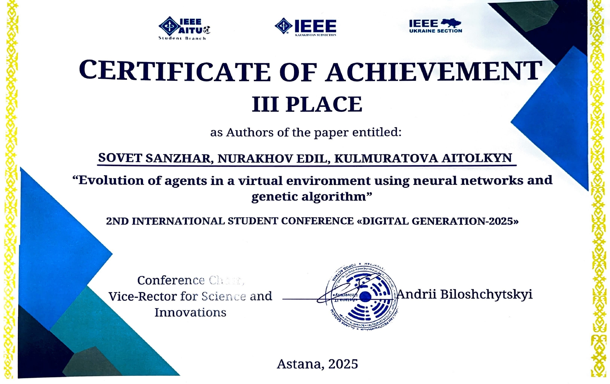

# Digital-aquarium

Этот проект представляет собой Reinforcement learning model, с децентрализованно мультиагентной, дискретной средой и агентами в виде простой нейросети.
Для обучения этой нейросети используется классический генетический алгоритм.

III место на 2025 IEEE AITU: Digital Generation
Sovet Sanzhar, Nurakhov Edil, Aitolkyn Kulmuratova, Evolution of agents in a virtual environment using neural networks and genetic algorithm

На данный еще не опубликована

На данный момент статья по проекту еще не выложена

Python 3.12.5

Моменты над которыми надо подумать:
+ баг с (-2, ??) координатами
+ обновление статистики
+ 